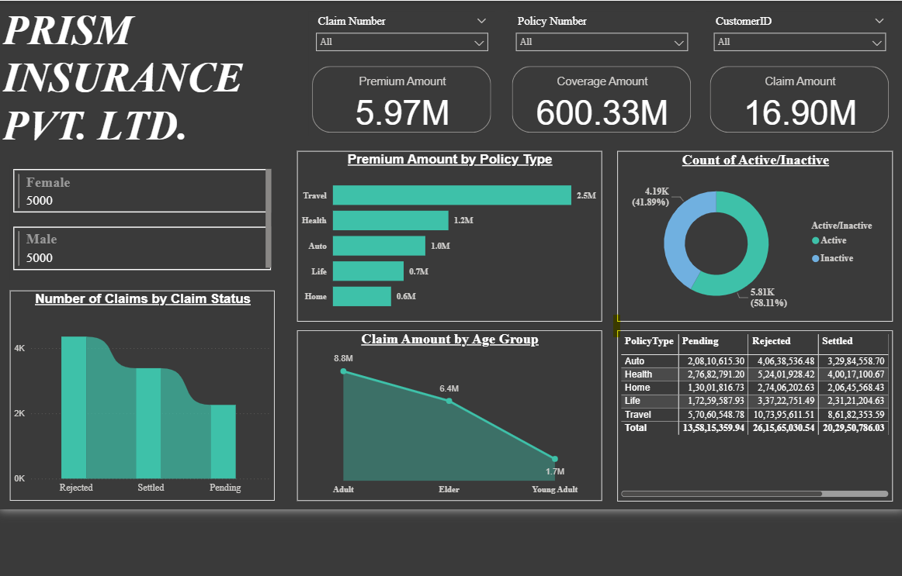
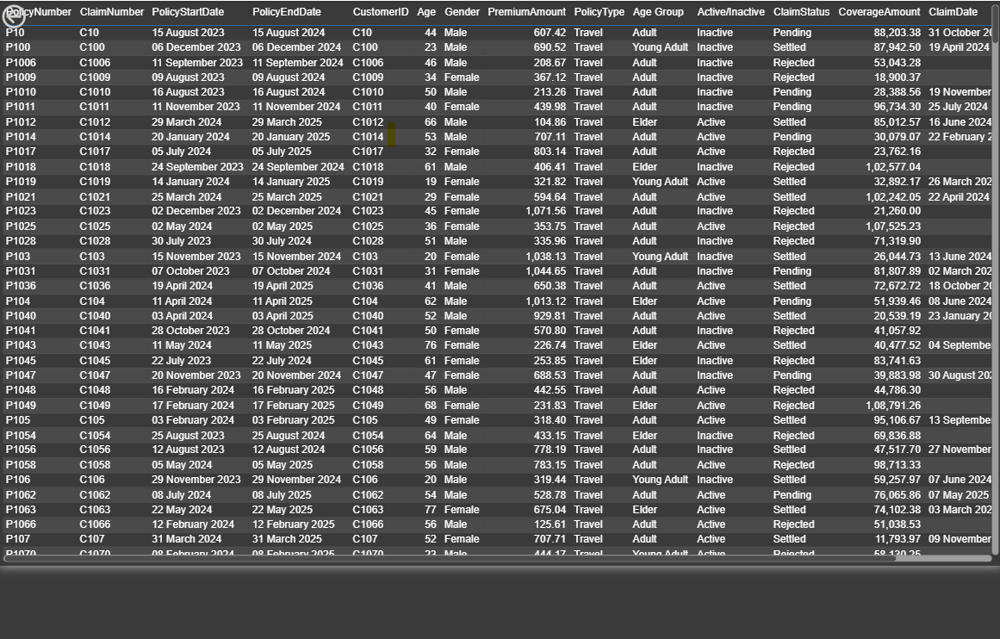
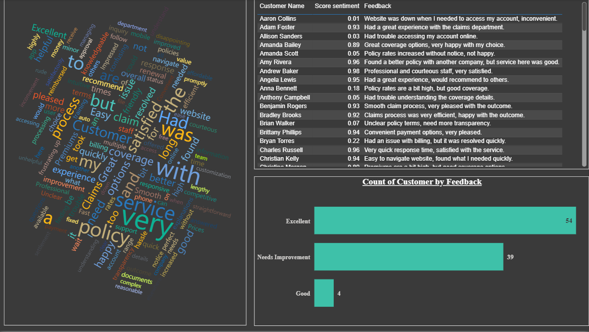

# 📊 Prism Insurance Report – Power BI Dashboard

An insightful Power BI dashboard that provides a comprehensive analysis of insurance data, combining structured insights with sentiment-driven analytics. This project demonstrates SQL integration, data modeling, text analytics, drillthrough interactivity, and dynamic visuals to support data-driven decisions.

---

## 🧩 Project Workflow

1. 🔗 **Data Import**  
   Imported raw insurance data directly from **SQL Server Management Studio (SSMS)**.

2. 🧹 **Data Cleaning & Transformation**  
   - Changed column data types for accurate aggregation and visualization  
   - Created a new column `Age Group` for customer segmentation  

3. 💬 **Text & Sentiment Analysis**  
   - Added **Sheet 2** for customer feedback processing  
   - Performed **text analysis** and computed a **sentiment score**  
   - Created a new column `Feedback` using categorized sentiment values  
   - Visualized insights using a **word map** of customer responses  

4. 📊 **Drillthrough & Interactive Filtering**  
   - Used a **stacked bar chart** filtered by `Policy Type`  
   - Enabled **drillthrough** to a detailed table showing policy-specific records  

---

## 🚀 Key Features

- 📈 Policy and Claim Performance Tracking  
- 👤 Age-based Customer Segmentation  
- 💬 Customer Feedback Sentiment Integration  
- 🌐 Word Map Visualization of Most Frequent Feedback  
- 📥 Drillthrough Capability by Policy Type

---

## 🛠️ Tools & Technologies

- **SQL Server Management Studio (SSMS)**  
- **Power BI Desktop**  
- **DAX**  
- **Text Analysis / Sentiment Scoring**  
- **Word Cloud Visualization**

---

## 🖼️ Dashboard Previews

| Page | Description |
|------|-------------|
|  | **Overall Report Page** – KPIs, visualizations, and filters |
|  | **Drillthrough Table** – Detailed view filtered by selected policy type |
|  | **Word Map View** – Most used words from customer feedback with sentiment |

---

## 📁 Project Structure

Prism-Insurance-Report/
├── RawData/                    # SQL-exported raw data (CSV or Excel)
│   └── insurance_data.csv
│
├── Images/                     # Screenshots of the report
│   ├── page1.png               # Overall report dashboard
│   ├── page2.png               # Drillthrough table view
│   └── page3.png               # Word map view
│
├── PrismInsuranceReport.pbix   # Main Power BI dashboard file
└── README.md                   # Project documentation

---

## 📁 File Included

- `PrismInsuranceReport.pbix` – Power BI file containing complete dashboard, data model, and visuals
